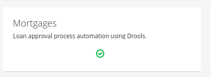
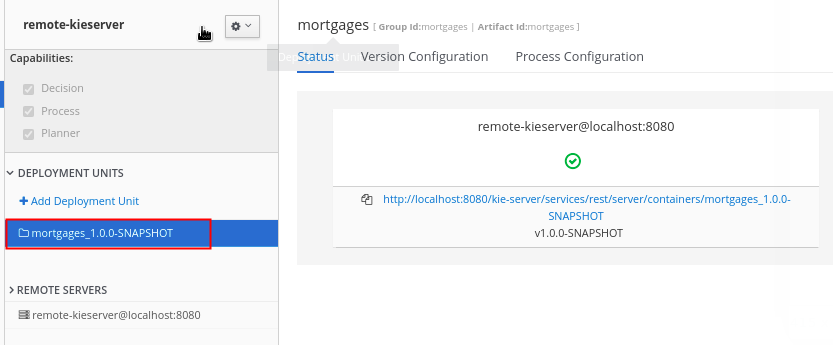
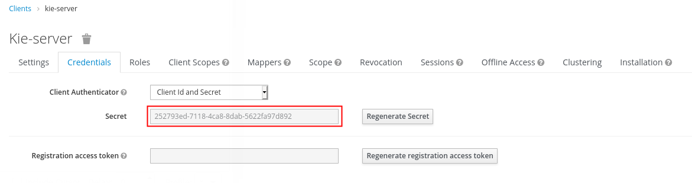

:numbered:

= RHPAM Provisioning

.Prerequisites:
* Existing *OCP 4.X* cluster environment
* Authentication to that existing OCP 4.X environment as a cluster admin user.

== Overview
This ansible assists in the provisioning of one or more Red Hat Process Automation Manager instances on a pre-existing OpenShift environment.

This ansible is useful for supporting demos and labs where the focus is the RH-PAM product.

The RH-PAM KIE-Server is configured to leverage a PostgreSQL database.

The following diagram depicts the OpenShift project and corresponding components provisioned by the ansible (along with related ansible):

image::docs/images/arch_topology.png[]

. *pam7-tools-{{ ocp_user }}*
+
This OCP project contains a Nexus server and a _pgadmin4_ server.

. *rhpam-dev-{{ ocp_user }}*
+
This OCP project contains the PAM Business Central and PAM Kie-server.
The PAM Kie-server stores the state of long running business processes in the _rhpam-postgresql_ database. 

. *rhsso-sso0*
+
RH-PAM offers the ability to optionally secure Business Central and Kie-server using the OpenID Connect protocol.
This _rhpam-dev-ansible_ project provides the ability to optionally integrate with a RH-SSO environment.
+
A RH-SSO environment can be provisioned using the link:https://github.com/gpe-mw-ansible-org/rh-sso-multi-realm/blob/master/README.adoc#kie-realm[rh-sso-multi-realm] ansible.
The _rh-sso-multi-realm_ ansible will create an OCP project called _rhsso-sso0_ . 
Within this _rhsso-sso0_ OCP project, a RH-SSO and corresponding mysql databased will be installed.
+
The RH-SSO instance will be pre-configured with a SSO realm called: _kieRealm_.
_kieRealm_ comes pre-configured with users and roles that support RH-PAM Business Central and Kie-Server.

== Optional Integration with RH-SSO
As per the link:https://access.redhat.com/documentation/en-us/red_hat_process_automation_manager/7.3/html-single/deploying_a_red_hat_process_automation_manager_authoring_environment_on_red_hat_openshift_container_platform/index#environment-authoring-single-proc[Deploying a RH-PAM Authoring Env on RHT OCP], Business Central and KIE-Server can be secured via the _OpenID Connect_ protocol by integrating with RH-SSO.

This ansible optionally allows for the provisioning of Business Central and KIE-Server integrated with a previously configured RH-SSO.

The out-of-the-box defaults for integration with RH-SSO closely allign with an RH-SSO provisioned via link:https://github.com/gpe-mw-ansible-org/rh-sso-multi-realm/blob/master/README.adoc#kie-realm[rh-sso-multi-realm] ansible.

All of the default ansible variables needed for integrating with RH-SSO can be found in the following file of this project:  roles/openshift_rhpam_dev/defaults/main.yml .
The default values of these variables can all be over-written at the _ansible-playbook_ command line.

=== Auto-Generated SSO Clients

Upon start-up of the Business Central and KIE-Server web apps, the following corresponding SSO clients will be created (by each of those web apps) in the `kieRealm` of RH-SSO:

. *business-central*
. *kie-server*

Both SSO clients are configured with an `Access Type` of: `confidential`

=== Smoke Test KIE-Server integrated with RH-SSO

In this section, you will retrieve an OAuth2 token from the `kieRealm` SSO realm and use that token to invoke the RESTful API of the KIE-Server.  For the purpose of demonstration, Linux/OSX command line tools will be used.

==== Deploy the `Mortgages` Application

In this quick start, you will use the `Mortgages` Trial Sample based on Drools

. Import the project via Business Central.

. Study the rules and data objects.

. Build and deploy to your KIE-Server.

. Set an environment variable whose value is the name of the newly deployed `deployment unit` :

.. Navigate to your `Execution Server` page:
+

. Set the environment variable:
+
-----
containerId=mortgages_1.0.0-SNAPSHOT
-----

==== Identify SSO Client Secret

The `kie-server` SSO client of the `kieRealm` allows for obtaining an OAuth2 token via the `Resource Owner Password Credentials` flow of OAuth2.

Because the `kie-server` sso client is configured as `confidential`, the SSO `client_secret` will be needed to retrieve the OAUth2 token.

. Authenticate into the `kieRealm` and identify the client secret of the `kie-server` client
+

. Set an environment variable called `sso_client_secret`:
+
-----
sso_client_secret=252793ed-7118-4ca8-8dab-5622fa97d892
-----

==== Invoke Mortage app via SSO Secured KIE-Server
Now that the Mortgage app has been deployed to your RH-PAM KIE-SERVER and you know the `client_secret` of your SSO kie-realm, you can obtain an OAuth2 access token from RH-SSO and use that token to invoke the rules of the Mortgage app via the RESTful API of the KIE-server.

. Set the following environment variables with values similar to the following:
+
-----
rhsso_hostname=keycloak-rh-sso.apps.g.p.com
kieserver_hostname=rhpam-kieserver-rhpam-dev-oncore.apps.g.p.com
retrieve_token_url="https://$rhsso_hostname/auth/realms/kieRealm/protocol/openid-connect/token"
-----

. Create a request payload that will be used when firing rules of the `Mortgage` sample application:
+
-----
echo '
{
  "commands": [
      { "insert": {
        "object": {
          "mortgages.mortgages.Applicant": {
            "name": "sarah",
            "age": 25,
            "creditRating": 650
          }
        },
        "out-identifier": "applicant_sarah",
        "return-object": true
      }}, 
      { "insert": {
        "object": {
          "mortgages.mortgages.LoanApplication": {
            "amount": 2500
          }
        },
        "out-identifier": "loanapp",
        "return-object": true
      }}, 
      { "insert": {
        "object": {
          "mortgages.mortgages.IncomeSource": {
            "amount": "50"
          }
        },
        "out-identifier": "incomesource",
        "return-object": true
      }}, 
      { "insert": {
        "object": {
          "mortgages.mortgages.Bankruptcy": {
            "yearOfOccurence": "1991",
            "amountOwed": "11000"
          }
        },
        "out-identifier": "bankruptcy",
        "return-object": true
      }},
    {
      "fire-all-rules": {
        "max": 10,
        "out-identifier": "firedActivations"
      }
    }
  ]
}

' > /tmp/mortgage_rules_execution.json
-----
+
Notice the existence of a bankruptcy fact in the payload.  Based on the rules of the Mortgage application, you can expect that a loan application will subsequently fail.

. Retrieve an OAuth2 token using the `kie-server` SSO client of `kieRealm`:
+
-----
TKN=$(curl -X POST "$retrieve_token_url" \
            -H "Content-Type: application/x-www-form-urlencoded" \
            -d "username=pamAdmin" \
            -d "password=admin1!" \
            -d "grant_type=password" \
            -d "client_id=kie-server" \
            -d "client_secret=$client_secret" \
            | sed 's/.*access_token":"//g' | sed 's/".*//g')

echo $TKN

eyJhbGciOiJSUzI1NiIsInR5cCIgOiAiSldUIiwia2lkIiA6ICJOd010SUpfRnFuY3BMODJSQWRJMkMxSklLcXJWUzlBRWVNSHM0RktRZi1BIn0.eyJleHAiOjE2MTA3NjEzMzUsImlhdCI6MTYxMDc2MTAzNSwianRpIjoiOGM1YzJlZTAtMmZmZi00MGFhLTg0MGYtZWE2N2MxYWViNWZjIiwiaXNzIjoiaHR0cHM6Ly9rZXljbG9hay1yaC1zc28uYXBwcy5yaHRuY2twbWcucmhzbGVkb2NwLmNvbS9hdXRoL3JlYWxtcy9raWVSZWFsbSIsImF1ZCI6ImFjY291bnQiLCJzdWIiOiIzMmE4NjczNi04MThiLTRiM2MtODQyZi0zY2U4OGU3MjJkZGMiLCJ0eXAiOiJCZWFyZXIiLCJhenAiOiJraWUtc2VydmVyIiwic2Vzc2lvbl9zdGF0ZSI6Ijk0M2Y3NzRhLTgyOTItNDg1Mi04MmZkLWY2ZGNiMGU0NzQ0YiIsImFjciI6IjEiLCJhbGxvd2VkLW9yaWdpbnMiOlsiaHR0cHM6Ly9yaHBhbS1raWVzZXJ2ZXItcmhwYW0tZGV2LW9uY29yZS5hcHBzLnJodG5ja3BtZy5yaHNsZWRvY3AuY29tOjQ0MyIsImh0dHBzOi8vcmhwYW0ta2llc2VydmVyLXJocGFtLWRldi1vbmNvcmUuYXBwcy5yaHRuY2twbWcucmhzbGVkb2NwLmNvbSJdLCJyZWFsbV9hY2Nlc3MiOnsicm9sZXMiOlsia2llbWdtdCIsImFkbWluIiwicmVzdC1hbGwiLCJBZG1pbmlzdHJhdG9ycyIsImtpZS1zZXJ2ZXIiLCJ1c2VyIl19LCJyZXNvdXJjZV9hY2Nlc3MiOnsiYWNjb3VudCI6eyJyb2xlcyI6WyJtYW5hZ2UtYWNjb3VudCIsIm1hbmFnZS1hY2NvdW50LWxpbmtzIiwidmlldy1wcm9maWxlIl19fSwic2NvcGUiOiJwcm9maWxlIGVtYWlsIiwiZW1haWxfdmVyaWZpZWQiOmZhbHNlLCJwcmVmZXJyZWRfdXNlcm5hbWUiOiJwYW1hZG1pbiIsImVtYWlsIjoicGFtYWRtaW5Ab3BlbnNoaWZ0Lm9wZW50bGMuY29tIn0.bmHT1R25G13c4CdYK2am-5-a-Y1QwRequsXg2C55fj7kdfBr8yJ7_qRrGQxQ4spy28f3O0vdtMc10O3h3HFTPZoCaGVqfciE4axcZI2zZLdVmc6qlmfLIj-hjZMqoOB-tAYyHcFoUN9mtQmJWhCaFO0JysCUpQHeOjssSizjjRHLW5Dsg5JHqZxR4iBuG-KBlfK-cI0ryeNQV5ljdP6nNn7UrEbhHP_rFyZlmHXgOAraL6MC75Rnra0nwIvg4Wu30WXppxT7HUlQj1lFBaZQUzmFXXJBXHBq_5ofNHgervMFtmyzlG_3r892e4JS1qZ7o4fDaXyMvD1RTa6WwKpC8g
-----

. Using the OAuth2 token, invoke the kie-server to determine its current status:
+
-----
curl -v \
    -H "Authorization: Bearer $TKN" \
    -X GET \
    https://$kieserver_hostname/services/rest/server
-----

. Using the OAuth2 token, invoke kie-server with payload to insert facts and fire all rules of the Mortgage application:
+
-----
curl -v \
    -H "Authorization: Bearer $TKN" \
    -H  "accept: application/json" \
    -H  "content-type: application/json" \
    -X POST http://$kieserver_hostname/services/rest/server/containers/instances/$containerId \
    -d @/tmp/mortgage_rules_execution.json
-----

. The response should include a JSON element that indicates that the loan application has been declined due to a prior bankruptcy:
+
-----
{
  "type" : "SUCCESS",
  "msg" : "Container mortgages_1.0.0 successfully called.",
  "result" : {
    "execution-results" : {
      "results" : [ {
        "value" : {"mortgages.mortgages.LoanApplication":{
  "amount" : 2500,
  "approved" : false,
  "approvedRate" : null,
  "deposit" : null,
  "explanation" : "has been bankrupt",
  "insuranceCost" : null,
  "lengthYears" : null
}}
-----

== Environment Variables

. *businesscentral_image_namespace*
+
Optional.  Default = rhpam-dev-{{ ocp_user }}
Name of project where Business Central image stream resides.

. *configure_smtp_relay*
+
Optional.
Default = false
+
When set to true, kie-server pod is injected with a sidecar that listens on port 25.
All outbound SMTP traffic will be relayed to a remote SMTP server.
This SMTP relay leverages the following additional variables:

.. *smtp_host*
.. *smtp_port*
.. *smtp_userid*
.. *smtp_passwd*

. *fake_smtp*
+
Optional.
Default = false
+
link:https://github.com/Nilhcem/FakeSMTP[FakeSMTP] is a Fake SMTP Server with GUI for testing emails in applications easily. It is written in Java.
+
When this variable is set to true, kie-server pod is injected with a fake SMTP server sidecar.

. *install_tools*
+
Optional. Default=true
+
When set to false, the _pam-7-tools-$userId_ namespace is not created and corresponding Nexus and PostgreSQL Admin Console are not provisioned.

. *kieserver_image_namespace*
+
Optional.  Default = rhpam-dev-{{ ocp_user }}
Name of project where KIE Server image stream resides.

. *kieserver_java_opts_append*
+
Optional.  Default = -Dorg.kie.mail.session=java:jboss/mail/Default
+
Used to add system properties to KIE-server 

. *OCP_WILDCARD_DOMAIN*
+
Required when provisioning RH-PAM KIE-Server
+
Examples: apps.ratwater.xyz

. *provision_businesscentral*
+
Optional; Default is true
+
When set to false, Business Central will not be provisioned

. *provision_kieserver*
+
Optional; Default is true
+
When is to false, neither KIE Server nor its corresponding postgresql database will not be provisioned

. *provision_monitoring*
+
Optional; Default is false
+
If set to true, a link:https://access.redhat.com/containers/#/registry.access.redhat.com/rhpam-7/rhpam-businesscentral-monitoring-rhel8[PAM Business Central Monitoring] pod will be provisioned.

. *rhsso_url*
+
Optional;
+
If set, value should be of convention:  https://sso-rhsso-sso0.apps-71b4.generic.opentlc.com/auth
+
If set, BC and KIE-Server will be configured to participate in OpenID Connect (OIDC) security

. *seq_start*
+
Optional.
Set this variable when needing to provision a lab environment for multiple students on an existing OCP environment.
Specify first rhpam env to manage; default = 1 ;  in which a project with the following name will be created: _rhpam-dev-user1_.

. *seq_end*
+
Optional.  Specify last rhpam env to manage; default = 1

. *use_cluster_quota*
+
Optional. Default value is: true
+
When true, creates a clusterquota that is assigned to the owner userId (ie:  user1) of the project where the RH-PAM deployment resides.
The values of this clusterquota are found in: _roles/openshift_quota/defaults/main.yml_

. *use_custom_pam*
+
Optional; 
+
Default value is false in which case PAM images from registry.redhat.io will be used.
+
If set to true, then custom images for Business-Central and KIE Server will be used.
The images are configured with users and groups required to support GPTE courses and labs.

. *use_ephemeral_postgresql*
+
Default value is false in which case PostgreSQL (for KIE-Server) uses a persistent volume claim.

== Install Examples

=== All Components

-----
ansible-playbook playbooks/install.yml \
 -e fake_smtp=true \
 -e configure_smtp_relay=false \
 -e use_custom_pam=true \
 -e kieserver_image=rhpam-ks-apd \
 -e kieserver_image_tag=7.8 \
 -e businesscentral_image=rhpam-bc-apd \
 -e businesscentral_image_tag=7.8 \
 -e use_ephemeral_postgresql=false \
 -e rhsso_url=https://$rhsso_hostname/auth \
 -e OCP_WILDCARD_DOMAIN=$OCP_WILDCARD_DOMAIN \
 -e install_tools=true \
 -e seq_start=1 -e seq_end=1
-----

=== Individual Components
. Provision PostgreSQL Admin Console
+
-----
$ ansible-playbook playbooks/pgadmin4.yml \
    -e ocp_user=$ocp_user \
    -e use_cluster_quota=$use_cluster_quota
-----

. Provision Nexus
+
-----
$ ansible-playbook playbooks/nexus2.yml \
    -e ocp_user=$ocp_user \
    -e use_cluster_quota=$use_cluster_quota
-----

. Provision Business Central (using custom GPTE images) only with no ClusterQuota
+
-----
$ ansible-playbook playbooks/rhpam_dev.yml \
    -e ocp_user=user1 \
    -e use_cluster_quota=false \
    -e use_custom_pam=true \
    -e provision_businesscentral=true \
    -e provision_kieserver=false
-----

== Custom PAM images generation

. Login to Red Hat registry
----
podman login registry.redhat.io
----

. Build images
----
git clone https://github.com/gpe-mw-training/advanced-process-development-labs-etc.git
cd advanced-process-development-labs-etc
mvn clean install
cd etc/kie-server-docker
podman build -t rhpam-ks-apd:1.4 .
----

. Push images
----
podman login quay.io
podman tag rhpam-ks-apd:1.2 quay.io/rhtgptetraining/rhpam-ks-apd:1.4
podman push quay.io/rhtgptetraining/rhpam-ks-apd:1.4
----

== Uninstall

-----
$ ansible-playbook playbooks/install.yml \
    -e ACTION=uninstall \
    -e seq_start=$seq_start \
    -e seq_end=$seq_end
-----
